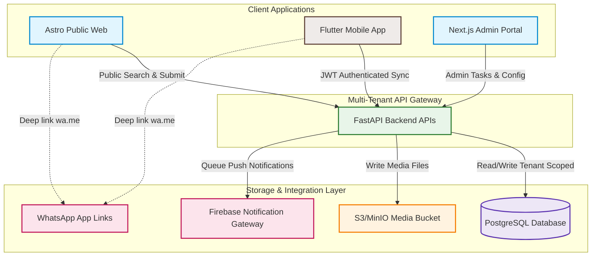

# System Architecture & Technical Specifications

## 1. System Context Diagram

This C4 System Context Diagram visualises the high-level boundary of the FYC Connect platform, its tenant segmentation, and integrations.



---

## 2. Database Entity Design (PostgreSQL ERD)

To satisfy **Multi-Tenancy (SNO-013)**, **Geographic Hierarchy (SNO-009)**, and **Audit Trails (SNO-007)**, a fully-normalized PostgreSQL relational schema is defined below.

```sql
-- 1. Multi-Tenant Organization Scope Table
CREATE TABLE organizations (
    id UUID PRIMARY KEY DEFAULT gen_random_uuid(),
    slug VARCHAR(50) UNIQUE NOT NULL, -- e.g., 'fyc-nagercoil', 'youth-club-b'
    name_ta VARCHAR(150) NOT NULL,
    name_en VARCHAR(150) NOT NULL,
    is_active BOOLEAN DEFAULT TRUE,
    created_at TIMESTAMP WITH TIME ZONE DEFAULT CURRENT_TIMESTAMP,
    updated_at TIMESTAMP WITH TIME ZONE DEFAULT CURRENT_TIMESTAMP
);

-- 2. Geographic Hierarchy Model
CREATE TYPE geo_level AS ENUM ('STATE', 'DISTRICT', 'TALUK', 'VILLAGE', 'WARD', 'STREET');

CREATE TABLE geographic_nodes (
    id UUID PRIMARY KEY DEFAULT gen_random_uuid(),
    parent_id UUID REFERENCES geographic_nodes(id) ON DELETE SET NULL,
    level geo_level NOT NULL,
    name_ta VARCHAR(100) NOT NULL,
    name_en VARCHAR(100) NOT NULL,
    pincode VARCHAR(10) NULL,
    created_at TIMESTAMP WITH TIME ZONE DEFAULT CURRENT_TIMESTAMP
);

-- Index for fast hierarchical querying
CREATE INDEX idx_geo_nodes_parent ON geographic_nodes(parent_id);

-- 3. Users Table (Multi-Tenant Context)
CREATE TABLE users (
    id UUID PRIMARY KEY DEFAULT gen_random_uuid(),
    organization_id UUID NOT NULL REFERENCES organizations(id) ON DELETE CASCADE,
    phone_number VARCHAR(15) NOT NULL,
    email VARCHAR(100) NULL,
    password_hash VARCHAR(255) NULL,
    role VARCHAR(30) NOT NULL, -- 'PUBLIC_CITIZEN', 'VOLUNTEER', 'CLUB_MEMBER', 'EXECUTIVE_MEMBER', 'ADMIN', 'SUPER_ADMIN'
    is_verified BOOLEAN DEFAULT FALSE,
    preferred_language VARCHAR(5) DEFAULT 'ta', -- 'ta' or 'en'
    created_at TIMESTAMP WITH TIME ZONE DEFAULT CURRENT_TIMESTAMP,
    updated_at TIMESTAMP WITH TIME ZONE DEFAULT CURRENT_TIMESTAMP,
    CONSTRAINT uq_org_phone UNIQUE (organization_id, phone_number)
);

CREATE INDEX idx_users_org ON users(organization_id);

-- 4. User Profiles Table (Bilingual details & Metadata)
CREATE TABLE user_profiles (
    user_id UUID PRIMARY KEY REFERENCES users(id) ON DELETE CASCADE,
    full_name_ta VARCHAR(150) NOT NULL,
    full_name_en VARCHAR(150) NOT NULL,
    address_line_ta TEXT NULL,
    address_line_en TEXT NULL,
    geography_id UUID REFERENCES geographic_nodes(id) ON DELETE SET NULL,
    profile_image_url TEXT NULL,
    last_login_at TIMESTAMP WITH TIME ZONE
);

-- 5. Digital Membership Card Table (SNO-005)
CREATE TABLE membership_cards (
    id UUID PRIMARY KEY DEFAULT gen_random_uuid(),
    user_id UUID UNIQUE REFERENCES users(id) ON DELETE CASCADE,
    membership_number VARCHAR(50) UNIQUE NOT NULL, -- e.g., 'FYC-2026-0034'
    qr_code_payload TEXT NOT NULL,
    status VARCHAR(20) DEFAULT 'ACTIVE', -- 'ACTIVE', 'SUSPENDED', 'EXPIRED'
    designation_ta VARCHAR(100) DEFAULT 'உறுப்பினர்',
    designation_en VARCHAR(100) DEFAULT 'Member',
    issued_at TIMESTAMP WITH TIME ZONE DEFAULT CURRENT_TIMESTAMP,
    expires_at TIMESTAMP WITH TIME ZONE NOT NULL
);

-- 6. Volunteer Skills and Hours Ledger (SNO-004)
CREATE TABLE volunteer_metadata (
    user_id UUID PRIMARY KEY REFERENCES users(id) ON DELETE CASCADE,
    skills TEXT[] NOT NULL DEFAULT '{}', -- e.g., {'Blood Coordination', 'First Aid'}
    availability_status VARCHAR(20) DEFAULT 'AVAILABLE', -- 'AVAILABLE', 'BUSY', 'INACTIVE'
    total_hours_accrued NUMERIC(10, 2) DEFAULT 0.00
);

CREATE TABLE volunteer_hours_ledger (
    id UUID PRIMARY KEY DEFAULT gen_random_uuid(),
    user_id UUID REFERENCES users(id) ON DELETE CASCADE,
    event_id UUID NULL, -- Links to events table if checked in at event
    activity_name_ta VARCHAR(150) NOT NULL,
    activity_name_en VARCHAR(150) NOT NULL,
    check_in_time TIMESTAMP WITH TIME ZONE NOT NULL,
    check_out_time TIMESTAMP WITH TIME ZONE NOT NULL,
    hours_calculated NUMERIC(5,2) GENERATED ALWAYS AS (
        EXTRACT(EPOCH FROM (check_out_time - check_in_time)) / 3600.00
    ) STORED,
    verified_by_user_id UUID REFERENCES users(id) ON DELETE SET NULL,
    created_at TIMESTAMP WITH TIME ZONE DEFAULT CURRENT_TIMESTAMP
);

-- 7. Blood Donors Network Table (Bilingual details)
CREATE TABLE blood_donors (
    id UUID PRIMARY KEY DEFAULT gen_random_uuid(),
    organization_id UUID NOT NULL REFERENCES organizations(id) ON DELETE CASCADE,
    user_id UUID UNIQUE REFERENCES users(id) ON DELETE CASCADE,
    blood_group VARCHAR(5) NOT NULL, -- 'A+', 'B+', etc.
    geography_id UUID REFERENCES geographic_nodes(id) ON DELETE SET NULL,
    is_available BOOLEAN DEFAULT TRUE,
    last_donation_date DATE NULL,
    created_at TIMESTAMP WITH TIME ZONE DEFAULT CURRENT_TIMESTAMP
);

-- 8. Public Issue Reporting Table (SNO-008)
CREATE TYPE issue_status AS ENUM ('NEW', 'ASSIGNED', 'UNDER_REVIEW', 'ESCALATED', 'RESOLVED', 'CLOSED', 'REJECTED');

CREATE TABLE public_issues (
    id UUID PRIMARY KEY DEFAULT gen_random_uuid(),
    organization_id UUID NOT NULL REFERENCES organizations(id) ON DELETE CASCADE,
    reported_by_user_id UUID NULL REFERENCES users(id) ON DELETE SET NULL, -- Nullable for anonymous web users
    category VARCHAR(50) NOT NULL, -- 'ROAD', 'WATER', 'STREET_LIGHT', 'GARBAGE', 'SAFETY'
    description_ta TEXT NOT NULL,
    description_en TEXT NOT NULL,
    latitude NUMERIC(10, 8) NOT NULL,
    longitude NUMERIC(11, 8) NOT NULL,
    geography_id UUID REFERENCES geographic_nodes(id) ON DELETE SET NULL,
    photo_url TEXT NOT NULL,
    verification_photo_url TEXT NULL,
    status issue_status DEFAULT 'NEW',
    assigned_volunteer_id UUID REFERENCES users(id) ON DELETE SET NULL,
    created_at TIMESTAMP WITH TIME ZONE DEFAULT CURRENT_TIMESTAMP,
    updated_at TIMESTAMP WITH TIME ZONE DEFAULT CURRENT_TIMESTAMP
);

-- 9. Events Table (Bilingual content)
CREATE TABLE events (
    id UUID PRIMARY KEY DEFAULT gen_random_uuid(),
    organization_id UUID NOT NULL REFERENCES organizations(id) ON DELETE CASCADE,
    title_ta VARCHAR(200) NOT NULL,
    title_en VARCHAR(200) NOT NULL,
    description_ta TEXT NOT NULL,
    description_en TEXT NOT NULL,
    event_start TIMESTAMP WITH TIME ZONE NOT NULL,
    event_end TIMESTAMP WITH TIME ZONE NOT NULL,
    banner_url TEXT NULL,
    geography_id UUID REFERENCES geographic_nodes(id) ON DELETE SET NULL,
    created_by_user_id UUID REFERENCES users(id) ON DELETE SET NULL,
    created_at TIMESTAMP WITH TIME ZONE DEFAULT CURRENT_TIMESTAMP
);

-- 10. Audit Trail & Log Table (SNO-007)
CREATE TABLE audit_logs (
    id UUID PRIMARY KEY DEFAULT gen_random_uuid(),
    organization_id UUID NOT NULL REFERENCES organizations(id) ON DELETE CASCADE,
    user_id UUID NULL REFERENCES users(id) ON DELETE SET NULL, -- Null if anonymous
    action_type VARCHAR(100) NOT NULL, -- e.g., 'STATUS_CHANGE_ISSUE', 'CONTACT_EXTRACTION_DONOR'
    target_table VARCHAR(50) NOT NULL,
    target_id UUID NOT NULL,
    old_values JSONB NULL,
    new_values JSONB NULL,
    ip_address VARCHAR(45) NULL,
    user_agent TEXT NULL,
    created_at TIMESTAMP WITH TIME ZONE DEFAULT CURRENT_TIMESTAMP
);

CREATE INDEX idx_audit_logs_org_type ON audit_logs(organization_id, action_type);
```

---

## 3. API Contract Specification (FastAPI Contracts)

All endpoints utilize standard JSON Request/Response payloads. Locale negotiation is executed via the `Accept-Language` header, and organization isolation is managed via `X-Organization-ID` (or mapped from subdomains).

### 3.1. Authentication APIs
* **Endpoint:** `POST /api/v1/auth/otp/send`
  * *Request Body:*
    ```json
    {
      "organization_id": "8f8b80b7-4b71-4770-b183-5c5f49e49a1d",
      "phone_number": "+919876543210"
    }
    ```
  * *Response (200 OK):*
    ```json
    {
      "message": "OTP sent successfully",
      "verification_id": "v_7e937d92a10d"
    }
    ```

* **Endpoint:** `POST /api/v1/auth/otp/verify`
  * *Request Body:*
    ```json
    {
      "verification_id": "v_7e937d92a10d",
      "otp_code": "123456"
    }
    ```
  * *Response (200 OK):*
    ```json
    {
      "access_token": "eyJhbGciOiJIUzI1NiIsInR5cCI6IkpXVCJ9...",
      "token_type": "bearer",
      "user": {
        "id": "e30d7b27-5d07-4c7a-bc12-f04bf4c86e00",
        "phone_number": "+919876543210",
        "role": "VOLUNTEER",
        "preferred_language": "ta"
      }
    }
    ```

### 3.2. Public Issue APIs
* **Endpoint:** `POST /api/v1/issues` (Submit Issue)
  * *Headers:* `Accept-Language: ta` (or `en`), `X-Organization-ID`
  * *Request Body (Multipart Form-Data for Photo):*
    * `category`: `"ROAD"`
    * `description`: `"தெருவில் பள்ளம் உள்ளது"` (or English fallback)
    * `latitude`: `8.1833`
    * `longitude`: `77.4119`
    * `geography_id`: `"3c1f2b34-8c88-466d-a120-d02bc34abccb"`
    * `file`: `[Binary Image Content]`
  * *Response (201 Created):*
    ```json
    {
      "id": "dc9c8b77-5120-410a-b333-d8a2a6e9a012",
      "category": "ROAD",
      "status": "NEW",
      "description": "தெருவில் பள்ளம் உள்ளது",
      "photo_url": "https://s3.fycconnect.org/issues/dc9c8b77.jpg",
      "created_at": "2026-06-14T11:45:00Z"
    }
    ```

* **Endpoint:** `PATCH /api/v1/issues/{issue_id}/status` (State Machine Transition - SNO-008)
  * *Headers:* `Authorization: Bearer <JWT>`
  * *Request Body:*
    ```json
    {
      "status": "ASSIGNED",
      "assigned_volunteer_id": "30db2a45-6677-4c7b-b89a-8eefc8c11aa9"
    }
    ```
  * *Response (200 OK):*
    ```json
    {
      "id": "dc9c8b77-5120-410a-b333-d8a2a6e9a012",
      "status": "ASSIGNED",
      "assigned_volunteer_id": "30db2a45-6677-4c7b-b89a-8eefc8c11aa9",
      "updated_at": "2026-06-14T11:47:30Z"
    }
    ```

---

## 4. Mobile Architecture (Flutter Clean Architecture)

The mobile application utilizes a standard 3-Layer Clean Architecture structure to support robust modular scaling.

```
       ┌─────────────────────────────────────────────────────────┐
       │                  Presentation Layer                     │
       │  - Views (UI widgets in Tamil/English UI)               │
       │  - Business Logic Components (BLoC / Cubits states)     │
       └──────────────────────────┬──────────────────────────────┘
                                  │ Uses
                                  ▼
       ┌─────────────────────────────────────────────────────────┐
       │                     Domain Layer                        │
       │  - Use Cases (e.g. SearchDonorsUseCase, SubmitIssue)    │
       │  - Entities (Domain objects with immutable structure)    │
       │  - Repository Interfaces (Data access contracts)        │
       └──────────────────────────▲──────────────────────────────┘
                                  │ Implemented by
                                  │
       ┌──────────────────────────┴──────────────────────────────┐
       │                      Data Layer                         │
       │  - Repositories (Handles database caching & API sync)   │
       │  - Data Sources (Retrofit/Dio API client, Local SQLite) │
       │  - Models (DTOs with JSON serialization mapping)        │
       └─────────────────────────────────────────────────────────┘
```

---

## 5. Security & Authentication Model

### 5.1. Authentication Framework
* **Protocol:** OAuth2 with JSON Web Tokens (JWT) signed using RS256 algorithm.
* **Token Lifespan:** Access Token expires in 1 Hour; Refresh Token expires in 30 Days.
* **Device Binding:** Device metadata checked during refresh token validation.

### 5.2. Multi-Tenant Row Level Security (RLS) simulation
For query execution, all SQL operations are wrapped through a BaseRepository class in FastAPI which appends the Active Tenant condition dynamically:
```python
# Repository Tenant Scoping Wrapper Pattern
class BaseRepository:
    def __init__(self, db_session, tenant_id: UUID):
        self.db = db_session
        self.tenant_id = tenant_id

    def get_query(self, model):
        # Automatically append organization filter to prevent cross-tenant leaks
        return self.db.query(model).filter(model.organization_id == self.tenant_id)
```

### 5.3. Audit Logger Integration (SNO-007)
A SQLAlchemy event listener captures all `before_update` and `before_insert` events on crucial models (`users`, `membership_cards`, `public_issues`) and automatically spawns asynchronous audit insertions.

---

## 6. Deployment Architecture (Docker VPS Layout)

The application is containerised using Docker Compose, optimized for cheap virtual private server (VPS) operations:

```
                            [ Internet User Request ]
                                        │
                                        ▼
                            [ Nginx Reverse Proxy ]
                                   (Port 443)
                                        │
                  ┌─────────────────────┼─────────────────────┐
                  │ (Path: /)           │ (Path: /api)        │ (Path: /admin)
                  ▼                     ▼                     ▼
          [ Astro SSG Web ]     [ FastAPI Server ]    [ Next.js Admin ]
           Port 3000 (Node)      Port 8000 (Python)    Port 3001 (Node)
                  │                     │                     │
                  └───────────┬─────────┴──────────┬──────────┘
                              │                    │
                              ▼                    ▼
                        [ PostgreSQL ]       [ Redis Cache ]
                          Port 5432            Port 6379
```
* **Asset Storage:** Media uploads (like road issue images) bypass FastAPI to upload directly to local MinIO (or AWS S3) via secure Presigned URLs generated by FastAPI, keeping network utilization low.
