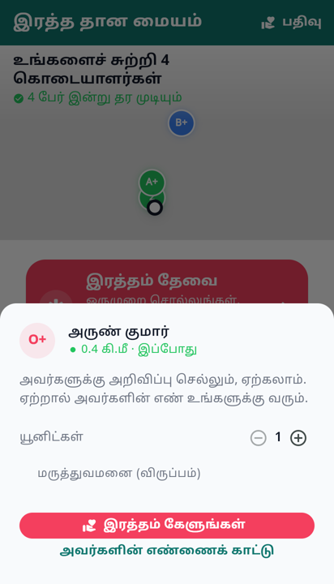
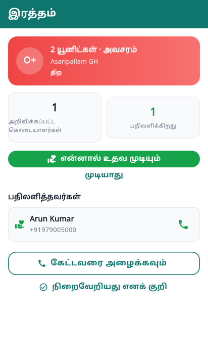

# Ask, don't call

Tapping a donor used to produce a confirmation dialog, then a phone number, and
then it was your problem.

That is the flow this app was built to replace. Someone at a hospital counter
with a hundred numbers cannot choose between them, so they start at the top and
dial: the first is out of town, the second gave blood last month, the third does
not pick up. The app knew all three of those facts and made the person in
trouble discover them by phone, one call at a time.

## The exchange, the other way round

You pick a person — the list already told you how far, how current that is, and
whether they can give today — and you ask. They get a notification with your
name on it, not a broadcast: *Meena asked you for O+.* They accept or they
don't.

**And their number arrives with the yes.** That is the point. The call you
eventually make is to somebody expecting it, and a declining donor's number is
never disclosed — declining is a real answer and it stays private. The server
enforces both halves: phone numbers go only to the person who asked, and only
for pledges in ACCEPTED or DONATED.

## Choices worth stating

**Targeted asks skip the radius filter.** A broadcast is filtered by distance,
group compatibility and eligibility. A targeted ask is not, because the
requester has already looked at all of that and chosen this person. Silently
dropping the request because the donor is a kilometre outside a radius would be
the app overruling the human.

**The ask is short.** Group and units are known or defaulted; the hospital is one
optional line. Someone standing at a counter will not fill in a form, and every
field is a chance to abandon it.

**Calling is still there.** An unanswered notification cannot be the only road
out of an emergency, so the number is one clearly-labelled tap away — *Show
their number instead*. Named honestly, so it reads as the second choice rather
than the reflex.

**No location is requested mid-ask.** The request carries a position if one is
already permitted, and otherwise goes without. A permission sheet between
somebody and help is an obstacle, and consent given in a panic is not consent.

## Two things that were broken the whole time

**The notification led nowhere.** The server has been sending
`route: /blood-requests/<id>` with every blood push since the feature was
written, and the app had no such route. A donor tapping *"can you help?"* and a
requester tapping *"a donor responded"* both arrived nowhere. The screen existed
— it was reachable only by raising a request in the same session.

**And that screen did not render.** `BloodRequestScreen` crashed on layout for
every open request: *BoxConstraints forces an infinite width*, leaving a blank
page under the app bar. The cause was one un-flexed button in a Row, which made
the row ask it for an intrinsic width. It is a Column of full-width buttons now
— which also fixes the Tamil, where "I can help" squeezed the decline button
down to `முடியா…`.

Both were invisible in the code and obvious the moment the screen was
photographed. To photograph it, the harness had to learn to tap: sheets and
dialogs are where a lot of this app's design lives, and a bottom sheet is not a
route, so none of it had ever been reviewed. It taps by key now, through real
hit-testing rather than by calling the callback — so what gets photographed is a
state the app can actually reach.
