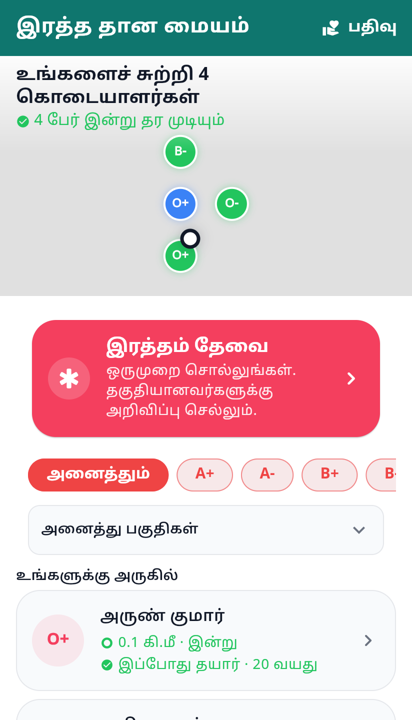
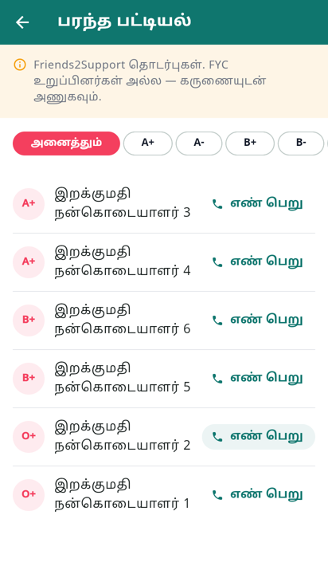

# The map that says "you are not alone here"

The blood screen used to answer the wrong question first. It opened on a filter
row and a directory: pick a group, pick a taluk, scroll two hundred names, start
cold-calling. The map existed, behind an icon in the app bar, which is a place
nobody goes.

But the first question someone in trouble asks is not *which blood group*. It is
**is there anybody near me?** — and that question has a shape: a count over a
field of dots. Every ride-hailing app has trained people to read it. Open the
app, see cars, feel that this is going to work.

So the map leads the page.

The heading is the largest thing on the panel, on purpose. *4 donors around you
· 4 can give today.* That lands before a single name is read, and it is the
emotional payload of the whole screen: not a slogan about saving three lives, a
true number about the people nearby.

## Honesty rules, because hope is easy to fake

**Two numbers, not one.** How many are around you, and how many of those could
give today. The second is smaller and harder, and dropping it would make the
panel a nicer lie.

**Both counted over the same population.** They are drawn from the mapped
donors, not from the whole list — two numbers taken from different sets is how a
heading ends up quietly disagreeing with the dots underneath it.

**Nothing before we know where you are.** "Nobody is around you" is a claim we
have not earned until the position resolves, and a discouraging one to flash at
someone who arrived in an emergency. The panel stays silent instead.

**The count and the dots must match.** At a fixed zoom the visible strip is about
four kilometres, so a donor six kilometres away was counted in the heading and
drawn off the edge. The camera now fits everyone it is counting, capped at a
neighbourhood zoom so one nearby donor does not slam it to street level.

**One pin can be several people.** The server publishes positions rounded to
about a kilometre, so neighbours are frequently the *same* point. A pin per donor
drew four people as one dot. Pins now carry a count, and the tap opens all of
them.

**The pin sits where the distance was measured from.** This one was a real bug:
a donor seen this morning a kilometre away has a home area twenty kilometres off,
and the map published the home area regardless. The row said one thing and the
map said another, and a member deciding who to call reads both.

**You are not a result.** The member's own dot is white with a dark ring —
neither green nor blue, because both of those already mean something here, and a
member who reads their own dot as "a donor seen recently" is counting themselves.

**No tiles is not an error.** A rural signal or an offline phone still gets the
dots and the count; the panel degrades to a plain field rather than to a failure.

## Friends2Support, kept apart

The imported contacts are not members. No account, no location, no notification,
no way of knowing whether the number still belongs to the person. Calling one is
a cold call to a stranger, and it should feel like one.

They used to sit in the club list with a small badge to tell them apart, which
quietly promised the same thing for both — a neighbour who volunteered and a
stranger's phone number, adjacent and identically weighted.

Now they are a separate screen behind a door at the bottom of the hub, and the
split is enforced at the source: `GET /blood-donors?source=club|imported`. The
map never shows them, because they have no position to show. The caveat is said
once at the top of their screen instead of being repeated as a badge on every
row, and the number sheet says the thing worth saying before you dial a
stranger: *this person is not expecting your call — please introduce yourself.*

The club list answers "who near me has agreed to be asked". This answers "I have
tried everyone and I need more numbers". Second stop, never the first.
