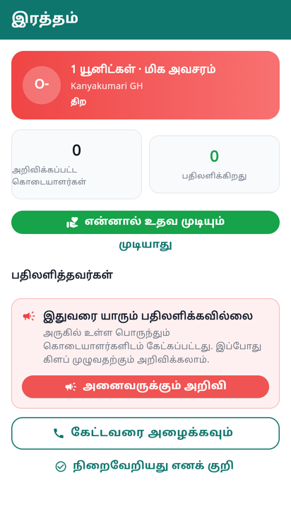
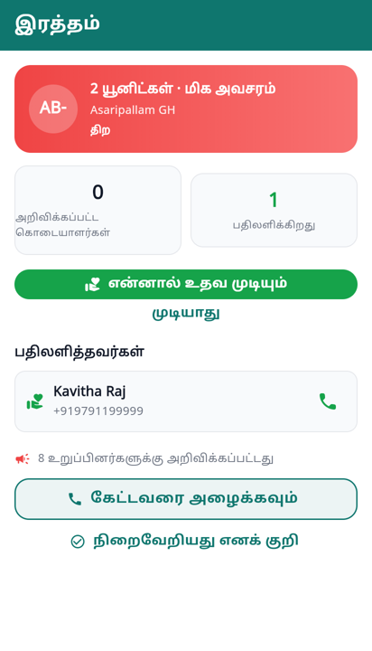

# Waking the whole club

The ordinary fan-out is filtered: compatible blood group, inside a radius,
eligible today, opted in, location shared. Every one of those filters is
correct, and every one of them can be the reason a request goes unanswered.

The person who can help might be a rare group with no match on file. Or someone
who never registered as a donor at all — and knows three people who did.

So there is one more step, and it is deliberately hard to reach.

## The guardrails are the design

A club-wide alert is the loudest thing this app can do, and it works exactly as
long as it stays rare. Three of them in a week and people turn notifications
off — which costs the *next* emergency far more than it costs this one. The
cost is never paid by the person who sends it.

Hence:

| | |
|---|---|
| **Who** | only the requester, or an admin |
| **When** | only while the request is open |
| **Unless** | somebody has already accepted — then waking four hundred more is not an emergency, it is noise |
| **How often** | once per request, never repeatable |
| **Ceiling** | a few per club per rolling day, whoever asks |

The confirmation says the size of the thing before it happens. "Everyone" is
abstract; a phone buzzing in four hundred pockets is not.

## What the message says

Not passed through the AI rewriter the other broadcasts use. In an emergency
the facts *are* the message, and a rephrasing is latency plus a chance to be
wrong about a blood group.

It names the person asking, and it asks for two things — donate, **or pass this
on**. Most people reading it cannot give that group. All of them know somebody.

## Accept

Accepting is the same pledge as anywhere else, so it works for a member who
never registered as a donor. And it carries the same payoff: the accepting
member's phone number goes to the requester, and only to them, and only on a
yes.

The screen then shows how many were woken, so the club can see what it spent.

## Three things this uncovered

**Every broadcast in the app was going to administrators only.**
`NotificationService.broadcast` defaulted to
`role.in_(["SUPER_ADMIN", "ADMIN", "MEMBER"])` — and `MEMBER` is not a role this
app assigns. The roles are `PUBLIC_CITIZEN`, `VOLUNTEER`, `CLUB_MEMBER`,
`EXECUTIVE_MEMBER`, `ADMIN`, `SUPER_ADMIN`. So every announcement, every new
event, every tournament notice since that line was written reached a handful of
people. The intent behind it was right — don't send club news to Friends2Support
contacts who never joined — and that is now expressed against the flag that
actually marks them.

**Opening one blood notification after another showed the first request twice.**
go_router reuses the screen's `State` when only the path parameter changes, so
`initState` never ran again and the previous request stayed on screen — blood
group, hospital and all. It reloads on an id change now.

**"Nobody has answered yet" appeared twice, word for word** — once as the
responders empty state and once as the escalation card's title, adjacent. The
empty state stands down when the card that says it better is about to appear.
