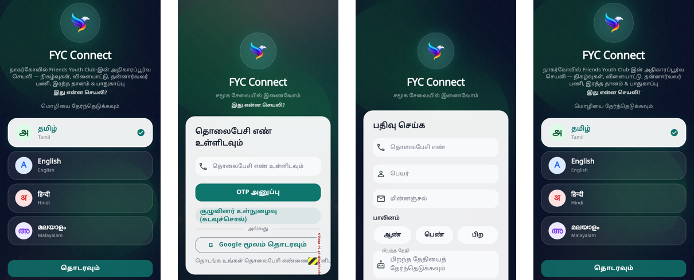
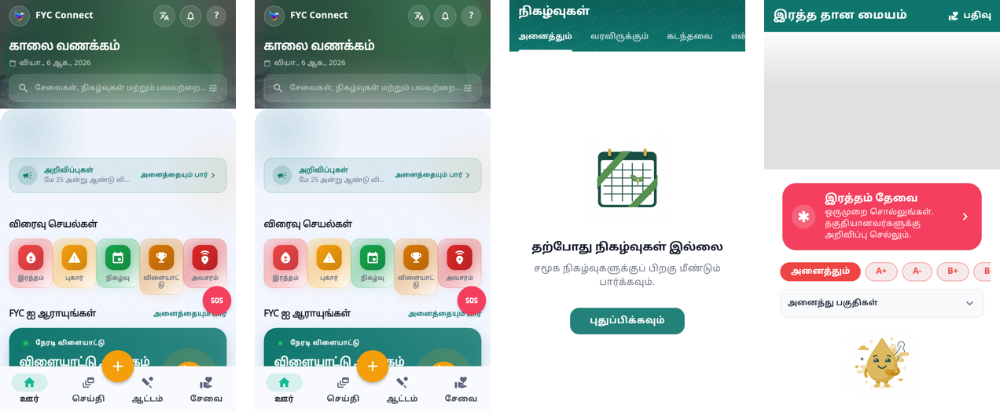
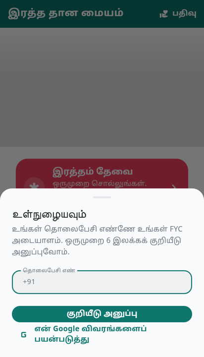

# There is no door

## What it was

Four screens before the app.



*Language → login → register → complete profile.*

| screen | asks |
|---|---|
| **Language** | shown on **every** launch. `isFirstLaunch` existed in `LocalStorage` and was never called. |
| **Login** | three doors, not two: phone + OTP, member password, Google |
| **Register** | phone *again*, name, email, gender, date of birth |
| **Complete profile** | phone *again*, name in **two scripts**, gender, date of birth — all of it asked one screen earlier |

Phone number: three times. Name: three fields. Date of birth and gender: twice
each. And Google was not a shortcut but the *longest* path — Google, then phone,
then OTP, then the same form.

The session machinery was never the problem. Refresh tokens, single-flight 401
recovery and request replay are all correctly built. The language gate is what
made it feel like signing in every time: any launch that was not already
authenticated started at `/lang-select`, which always led to `/login`.

## What it is



**The app opens into the app.** No token, no account, nothing typed — the
noticeboard, quick actions, live scores, events, the blood map. All of it, in
the phone's own language. The API already answered every one of those endpoints
anonymously; nothing was stopping this but a redirect.

**Identity is a step in an action, not a gate.** It is asked at the moment
something needs a name behind it — registering for an event, offering to donate,
asking a donor, posting — and afterwards you land back exactly where you were.



**One door, three steps, and the last one only for new members.** Number, code,
name. Google stops being a separate path and becomes a *fill* — it supplies the
name so there is less to type. The number is still what identifies a member,
because it is what the club already knows people by. The password door retires
from the member app; the admin console keeps it.

**Signing up collects nothing but a name.** No form. Date of birth, gender,
blood group, area — all still wanted, all asked afterwards, one question every
few days, by the profile-prompt system that already exists in this app and was
never pointed at registration.

**The language is detected, not demanded.** A Tamil phone opens a Tamil app.
Settings owns the preference, which is where a preference belongs. An
unrecognised locale falls back to Tamil rather than English — in Nagercoil that
is the better guess.

## The line for what stays private

The guard was inverted. It used to be *deny everything except a list of public
routes*; it is now *allow everything except a list of members-only ones*:

```
/me  /profile  /membership  /certificate  /journey
/directory  /members  /settings  /notifications
```

That list is about **people's data**, not about features. A member's phone
number, their profile, their membership card, their saved certificate: those
need a name attached. Reading the club's noticeboard does not.

## What is still to do

- **SMS auto-read.** The code field already declares `AutofillHints.oneTimeCode`
  and submits on the sixth digit, so on Android the code fills itself once the
  SMS is formatted for the Retriever API — a backend change to the message body.
- **Credential Manager** for the number itself, so the phone step is one tap.
- **Passkeys**, deliberately after the tournament: reinstall and new-device
  sign-in with a fingerprint instead of an SMS, which also removes a recurring
  Twilio cost.
- The old `/login`, `/register` and `/complete-profile` screens are still routed
  but nothing links to them any more. They come out once the new path has been
  used on real devices.
