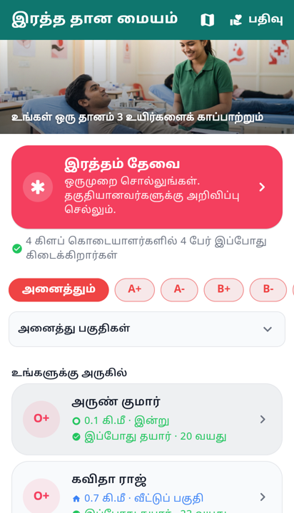

# Two positions per donor, and why they must not be one

A donor has two locations, and they answer different questions.

**The home area** — captured when they register. Where they usually are. Always
present, rarely wrong, never precise about *right now*.

**Where they were last seen** — captured when they opened the app. Precise about
a moment, and that moment may have been five minutes or five months ago.

Rapido shows both and does not confuse them: a pin for where you are going, a
moving dot for the driver. Nobody mistakes one for the other, because they do
not look the same. That is the whole idea here.

## The bug this uncovers

`BloodDonor.latitude/longitude` is a single pair. The registration flow writes
it, and the new app-open update **overwrites it**.

So a donor who registers in Nagercoil and then opens the app once while visiting
Chennai has, permanently, a home area of Chennai — until they open the app
somewhere else. The stable fact has been destroyed by the volatile one, and
nothing records that it happened.

One pair of columns cannot hold two claims. They need to be separate.

    home_lat, home_lng                    -- set at registration, changed rarely
    last_seen_lat, last_seen_lng,
    last_seen_at                          -- opportunistic, overwritten freely

## Three states, not two

Two colours imply two states, and there are really three. A position from this
morning and one from last March are both "last seen", and treating them alike is
the same lie as having no timestamp at all.

| State | What it means | What the requester should read |
|---|---|---|
| **Live** | Seen within the hour | "seen 20 minutes ago" |
| **Recent** | Seen within a day | "seen this morning" |
| **Home** | No recent fix, or none ever | "lives in Ozhuginasery" |

Colour carries this, but must not carry it alone. Colour-blind members exist, and
a colour with no legend is a guess. So each state gets a colour **and** a shape
**and** a line of text. The text is what actually communicates; the colour makes
it scannable.

## Which position the search ranks by

The freshest one that is still meaningful: last-seen if it is under a day old,
otherwise home. And the result says which it used — a distance whose basis is
hidden is a distance that cannot be judged.

## Where the Rapido analogy stops

Worth being careful here, because copying it too faithfully would be a mistake.

Rapido shows a driver's live position **to one rider, after a booking, for the
length of one trip**. It does not show every driver's live position to everyone
browsing the app. That distinction is the entire privacy model, and it is easy
to lose when borrowing the visual language.

So:

- **Home area is public to members.** It is coarse, it is what someone consented
  to share as a donor, and it is what the list has always shown.
- **Last-seen is not.** Precise, current position is shown only in the context of
  an active request the donor has accepted — the equivalent of the booking.
  Elsewhere it is used for *ranking* and rendered as a state, not a point:
  "seen this morning, 3 km away", not a dot on a map.

A member idly browsing the donor list should never be able to watch where another
member currently is. That is not a feature, and in a town this size it would be
the last thing the club ever shipped.

## Consent covers both, separately

`location_consent` today is one flag. Two positions with different exposure
deserve two answers:

- share a home area, so people can find a donor nearby;
- share a recent position while a request is open, so the nearest can be found
  quickly.

Someone may well agree to the first and not the second, and that is a reasonable
position to hold rather than an edge case to design around.

## What it looks like

Three states, each carried three ways so no single channel is load-bearing:

| | colour | shape | words |
|---|---|---|---|
| seen within the hour | green | filled dot | "0.6 km away · now" |
| seen within the day | green | hollow ring | "0.6 km away · today" |
| no recent fix | blue | house | "4.4 km away · home area" |

Greyscale still reads. A viewer who does not separate the two hues still reads.
Colour alone would have been the cheapest version and the one that fails
quietly for the people it fails for.

### Two things the screenshot found

The card carried this on **one** status line, which held in English and clipped
in Tamil — the age fell off the end entirely, and the word "now" appeared twice
in a row meaning two different things (seen now, can donate now). It is two
lines now: where they are, then whether they can give. One question each.

The distance ranking was also arriving and then being **thrown away**. The hub
asks for the plain list on open and for the ranked list once it has a position;
bloc runs handlers for different event types concurrently, so the two were
racing, and the ranked reply — smaller, and consistently first — lost to the
plain one every time. The screen showed no distances at all and reported no
error. A sequence number in the bloc makes it last-*asked* wins, and
`blood_donor_bloc_test.dart` fails without it.

Neither was visible in the code. Both were obvious in a photograph.
