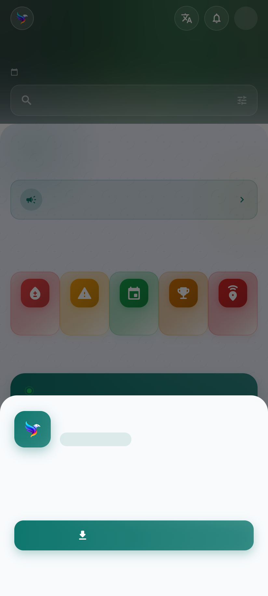

# Parity is a build target, not a project

> "We can't say our Android app is better but web is down."

Correct, and the gap was large. Everything from this session — the map-led
blood screen, presence colouring, ask-a-donor, the emergency broadcast, the
Friends2Support directory by taluk, browse-before-sign-in, the single sign-in
sheet, four enforced languages — existed only on Android.

The obvious plan was to port fifteen features into the Astro site. That plan is
wrong, and the reason is the evidence of this session: **two implementations of
the same product drift, and the drift is invisible until somebody photographs
it.** Building the same features twice guarantees doing this again next year.

## What is actually true today

```
$ flutter build web --release --no-web-resources-cdn
✓ Built build/web                                        86.6s
```



The entire member app already compiles and runs in a browser from the same
source: same Home, same tiles, same shell, Hive storage working, the API being
called, signed-out 401s behaving exactly as they do on the phone. Nothing was
built for this. `mobile/web/` has been scaffolded the whole time.

*(Text is blank in that screenshot only because this sandbox blocks
`fonts.gstatic.com` — see below, because that is a real problem too.)*

So parity is not fifteen features of work. It is a deploy target.

## The shape

| surface | serves | why |
|---|---|---|
| **Astro** (`fycconnect.com`) | landing, about, share links (`/e/K7P2`, `/t/K7P2`), public live scoreboards | static, instant, indexable — a WhatsApp link must open in under a second on a weak connection and be readable by a search engine |
| **Flutter Web** (`app.fycconnect.com`) | the member app, all of it | one codebase with Android, so parity cannot drift |

Astro keeps what it is genuinely better at. Everything with a member's name on
it comes from the same source as the phone.

## Two things to fix before this ships

**Fonts are fetched from Google at runtime.** `google_fonts: ^6.2.0` downloads
Roboto from `fonts.gstatic.com` on first paint. On a network that filters
gstatic — school Wi-Fi, some ISPs — the app renders with no text at all: not an
error, not a fallback, just blank. Exactly what the screenshot above shows. The
fix is to bundle the faces in `pubspec.yaml` rather than fetch them.

**CanvasKit was fetched from a CDN too.** `--no-web-resources-cdn` serves the
~5 MB WebAssembly runtime from our own origin instead of gstatic. Without it,
the same filtered network gets a blank page and one console error nobody will
read. That flag belongs in the build.

## What this does not settle

- **First load** is heavier than a static page. Acceptable behind a splash for a
  member app; not acceptable for a shared scoreboard link, which is why those
  stay on Astro.
- **Deep links** need `app.fycconnect.com/blood-donation` to serve `index.html`
  for every path, so go_router can take over.
- **The old Astro member pages** (`login.astro`, `blood-donors.astro`,
  `chess-play.astro`, …) become redirects into the app, and stop being a second
  thing to maintain.
